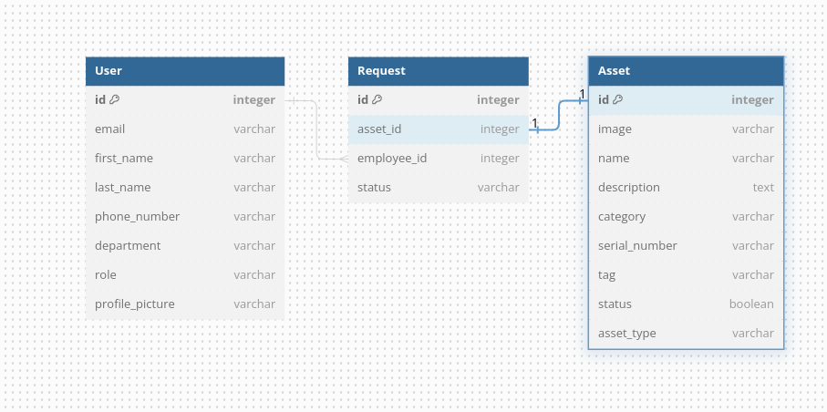

# Asset Requisition Stystem (Backend)

## Overview
This is the backend for the Asset Requisition System. It is a RESTful API that provides endpoints
for the following:
- User Authentication
- User Management
- Asset Management
- Requisition Management
- Requisition Approval Management
- Requisition History Management
- Requisition Status Management

## Getting Started
### Prerequisites
- Pipenv or pip
### Installation Instructions
- Clone the repository
- Install the dependencies using pipenv or pip


### Setup and Configuration
- Run ``` python manage.py seed ``` to populate the database with seed data **You can skip this part if you do not wish to populate**
- Run the server using the command "python manage.py runserver"

## Architecture

### Project Structure

The project follows a standard Django structure with some customizations. Below is an overview of the key directories and files:

#### Root Directory
- **`manage.py`**: Command-line utility for administrative tasks (e.g., running the server, creating migrations).

- **`requirements.txt`**: Lists the Python packages required for the project.

- **`README.md`**: Documentation file that provides an overview of the project.
- **`Pipfile`**:Contains the python packages required for the project
#### `api/`
- **`__init__.py`**: Marks this directory as a Python package.

- **`models.py`**: Contains the database models for the application.

- **`views.py`**: Defines the views (business logic) for the application.

- **`serializers.py`**: Contains serializers for converting complex data types into JSON and vice versa (used with Django REST Framework).

- **`management/`**: Custom management commands for the Django project.
  - **`__init__.py`**: Marks this directory as a Python package.
  - **`commands/`**: Contains custom management commands.
    - **`seed.py`**: A custom command to seed the database with initial data.

- **`tests/`**: Contains test cases for the application.
  - **`__init__.py`**: Marks this directory as a Python package.
  - **`test_views.py`**: Contains tests for the views.

#### `backend/`
- **`__init__.py`**: Marks this directory as a Python package.

- **`settings.py`**: Contains project settings and configurations.

- **`urls.py`**:Contains the endpoint urls for the project

- **`wsgi.py`**: WSGI entry point for the application.

- **`asgi.py`**: ASGI entry point for asynchronous capabilities (if used).

#### `migrations/`
- **`__init__.py`**: Marks this directory as a Python package.
- Contains migration files for database schema changes.
## MODELS
Here is an erd to explain the relationships between the tables:




### Custom User Model
The project uses a **custom user** model rather than usingf the custom built in Django user model
The Custom User Model extends Django’s built-in AbstractUser to create a user model with additional fields and a custom manager.

**Fields:**
- `email`: The user's email address.
- `password`: The user's password.
- `first_name`: The user's first name.
- `last_name`: The user's last name.
- `phone_number`: The user's phone number
- `department`: The user's department
- `role`: The user's role

**Custom Manager**- handles user creation and superuser creation with custom validations. It overrides the `create_user `and `create_superuser` methods to ensure that the email is normalized and required fields are provided.
### Asset Model
The Asset Model represents an asset in the system and includes various attributes to describe the asset.
**Fields:**
- `image`: A Cloudinary field to store an image of the asset.
- `name`: The name of the asset.
- `description`: A text field providing a detailed description of `the asset.
- `category`: A character field for categorizing the asset.
- `serial_number`: A unique identifier for the asset.
- `tag`: An additional identifier or tag for the asset.
- `status`: A boolean field indicating whether the asset is active`(True) or inactive (False).
- `asset_type`: A character field specifying the type of asset.

### Request Model
The Request Model tracks requests made by users for assets. It includes information about the asset requested, the user who made the request, and the status of the request.

**Fields:**
- `asset`: A foreign key field referencing the asset being requested.
- `employee`: A foreign key field referencing the user who made the request.
- `status`: A character field indicating the status of the request (e.g., "pending",)

**Relationships:**
 Each request is associated with one asset and one user. The `asset` field establishes a many-to-one relationship from `Request` to `Asset`, meaning multiple requests can be made for a single asset.
 The `employee` field establishes a many-to-one relationship from `Request` to`User`, meaning multiple requests can be made by a single user
## APIs

### Endpoints
1. #### User endpoints
- **/user/register**: Register a new user.
- **/user/login/**: Authenticate a user and provide a login token.
- **/user/updatepassword/**: Update the user's password.
- **/user/userdetails/**: Retrieve details of the currently authenticated user
- **/user/changerole/**: Change the role of a user.
- **/user/deleteUser/**: Delete a user from the system.

- **/user/allusers/**: Get a list of all users.

2. #### Asset Endpoints
- **/assets/add/**: Add a new asset to the system.
- **/assets/allassets/:**: Retrieve a list of all assets.
- **/assets/int:asset_id/request/**: : Request an asset by its ID.
3. #### Request Endpoints
- **/requests/**: Retrieve a list of all asset requests.
- **/requests/int:request_id/**: Perform actions on a specific request by its ID

### Serializers

- `UserSerializer`: Serializes User model instances for creating and updating users, and also for reading user data.
- `AssetSerializer`: Serializes Asset model instances for creating and updating assets, and also for reading asset
data.
- `RequestSerializer`: Serializes Request model instances for creating and updating requests, and also for reading request
data.

### Views
#### User Views

- `UserRegistrationView`: Handles user registration by validating and saving user data. No authentication required.
- `UserLoginView`: Authenticates users and returns a token. If the credentials are valid, a token is created or updated. No authentication required for login.
- `UserDetailView`: Returns details of the currently authenticated user. Requires the user to be authenticated (IsAuthenticated).
- `AllUsersView`: Retrieves a list of all users. No authentication required.
- `UserUpdatePasswordView`: Allows the authenticated user to update their password. Requires the user to be authenticated (IsAuthenticated).
- `ChangeUserRoleView`: Allows an admin or superadmin to change a user's role. Requires the user to be authenticated (IsAuthenticated) and have an admin or superadmin role.
- `DeleteUserView`: Allows an admin or superadmin to delete a user. Requires the user to be authenticated (IsAuthenticated) and have a superadmin role.

#### Asset Views

- `AssetAddView`: Allows authenticated users (excluding employees) to add new assets. Requires the user to be authenticated (IsAuthenticated).
- `AssetListView`: Retrieves a list of all assets. No authentication required.
- `AssetUpdateView`: Allows authenticated employees to request an asset by ID. Changes the asset status to requested and logs the request. Requires the user to be authenticated (IsAuthenticated).
- `AssetDeleteView` : Allows superadmins the ability to remove an asset.
#### Request Views

- `RequestListView`: Retrieves a list of all asset requests. No authentication required.
- `RequestActionView`: Allows admins or superadmins to approve or reject requests. Updates the request status and adjusts the asset status accordingly. Requires the user to be authenticated (IsAuthenticated) and have an admin or superadmin role.
- `EmployeeRequestListView` : Allows an employee who has mase requests be able to view them

## Testing
 In order to test, run ``` python manage.py test api.tests```
